<p align="center">
</img>&nbsp;
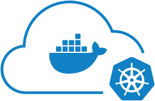</img>&nbsp;
</img>
</p><br/>

# Kubernetes Docker Machine

Swiss-knife toolset usefuly for creating local/remote Rancher Server with Kubernetes cluster provisioning, via docker-machine command.


## Goals

Main goal is to reproduce locally or on the cloud a Rancher orchestrated kubernetes cluster with the possibility to test locally any containers provisioning, having a full demo of the Rancher / Kubernetes combined architecture.


## Rancher Kubernetes Architecture

Kuberernetes and rancher combine architecture will be composed of following actors:

* etcd -  Nodes with the etcd role run etcd, which is a consistent and highly available key value store used as Kubernetes’ backing store for all cluster data. etcd replicates the data to each node. (Nodes with the etcd role are shown as Unschedulable in the UI, meaning no pods will be scheduled to these nodes by default)

* controlplane - Nodes with the controlplane role run the Kubernetes master components (excluding etcd, as it’s a separate role). See Kubernetes: Master Components for a detailed list of components (Nodes with the controlplane role are shown as Unschedulable in the UI, meaning no pods will be scheduled to these nodes by default).

* kube-apiserver - The Kubernetes API server (kube-apiserver) scales horizontally. Each node with the role controlplane will be added to the NGINX proxy on the nodes with components that need to access the Kubernetes API server. This means that if a node becomes unreachable, the local NGINX proxy on the node will forward the request to another Kubernetes API server in the list.

* kube-controller-manager - The Kubernetes controller manager uses leader election using an endpoint in Kubernetes. One instance of the kube-controller-manager will create an entry in the Kubernetes endpoints and updates that entry in a configured interval. Other instances will see an active leader and wait for that entry to expire (for example, when a node is unresponsive).

* kube-scheduler - The Kubernetes scheduler uses leader election using an endpoint in Kubernetes. One instance of the kube-scheduler will create an entry in the Kubernetes endpoints and updates that entry in a configured interval. Other instances will see an active leader and wait for that entry to expire (for example, when a node is unresponsive).

* worker - Nodes with the worker role run the Kubernetes node components. See Kubernetes: Node Components for a detailed list of components.


A whole picture overview architectural of Rancher-Kubernetes cluster is available [here](/images/clusterdiagram.png)


## Procedures Flow

### Target Kubernetes infrastructure overview

Infrastructure allows to ralizes a design in which all connections to the Kubernetes Clusters can be directed by the Ranche LB.

It provides access protocols, and leave the Kubernetes Cluster Namespaces and Namespace policies (Second authorization level) to allow or reject the connection. 

It's very fast, because accesses are cached with a timeout. Rancher can be provided by user access, policies, certificates and key, locally (container) or cloud provided.

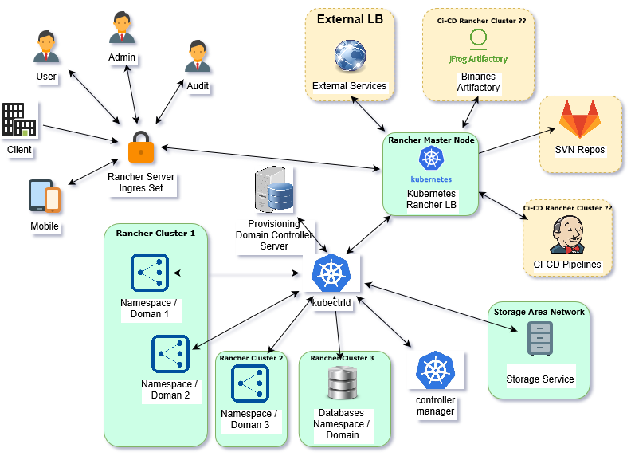


### Main Infrastructure provisioning flow

Inital Provisioning will create a Rancher Server on a Rancher Master Machine, the an initial default Kubernetes Cluster.

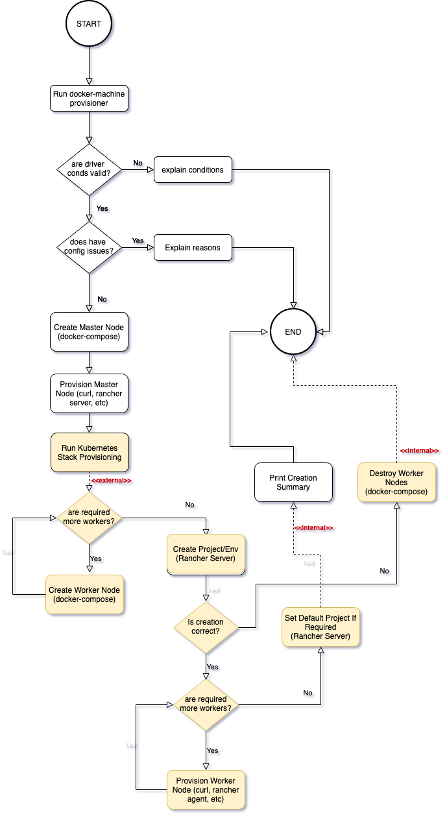


## Extends with new clusters flow

Anytime you need more clusters in the Rancher Server Domain, you can create the using following flow.

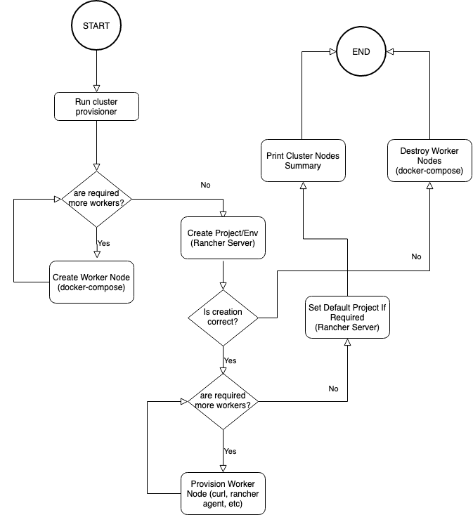


## Deploy Elements in the Kubernetes Cluster flow

Anytime you have to install new elements in the Kunernetes Cluster you can use following flow.

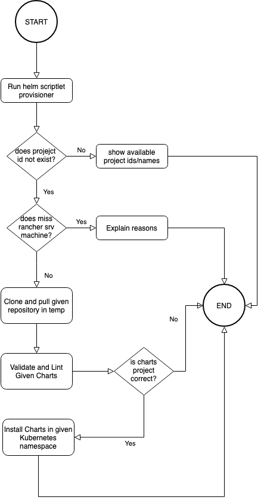


## Pre-Requisites

Project is design to work under following Operating Systems:

* Windows (Any)

* Unix (Any)

* Linux (Any)

* Mac-Os (Any)


For non-Windows Operating Systems it's required installation of available distro of following libraries:

* [curl](https://curl.haxx.se/) -> net call tool

* [jq](https://stedolan.github.io/jq/) -> json parser tool

IMPORTANT: For all Operating Systems you must provide a Web Browser, for Cluster Web UI Validation, it proves using the ui acess at first server start it's human driven deploy.

For all Operating Systems you can provide locally your preferred version of following commands in the vinary path:

* [helm](https://helm.sh/) -> Kubernetes Charts Tool

* [kind](https://kind.sigs.k8s.io/) -> Kubernetes Types Tool

* [kops](https://kops.sigs.k8s.io/) -> Kubernetes Deploy Automation Tool


## Provided artifacts

Following scripts are provided for the DevOps:

* [create-docker-machine-rancher.sh](/create-docker-machine-rancher.sh) - Provides platform creation via docker-machine command (required)

* [destroy-docker-machine-rancher.sh](/destroy-docker-machine-rancher.sh) - Destroys required infrastructure

* [provision-cluster-docker-machines-rancher.sh](/provision-cluster-docker-machines-rancher.sh) - Provision a new Kubernetes cluster and nodes

* [unregister-cluster-docker-machine-rancher.sh](/unregister-cluster-docker-machine-rancher.sh) - Purge a Kubernetes Cluster under Rancher Orchestrator

* [deploy-in-cluster-rancher-kubernetes-charts.sh](/deploy-in-cluster-rancher-kubernetes-charts.sh) - Check, Lint and Deploy charts from a given repository URL and branch


### Create the infrastructure 

Rancher Kubernetes infrastructure can be created using [create-docker-machine-rancher.sh](/create-docker-machine-rancher.sh) command.

Command accepts following arguments:

* docker-machine engine (mandatory) - It describes the reuired docker-machine engine

* project machine prefix (optional but strongly suggested) - It describes the machine prefix and distinguish multiple infrastructures under docker-machine and Rancher Server

* force flag [-f] (optional) - It provides a mutual acceptance of entry parameters (strongly not reccommended for cluod platforms, in case of non experience)

Available docker-machine engines:

* `-hv` - Microsoft Hyper-V
* `-vb` - Oracle Virtual Box
* `-gce` - Google Cloud Engine
* `-aws` - Amazon Web Services


There are some available environment variables:

* GOOGLE_APPLICATION_CREDENTIALS (mandatory in case of google cloud engine driver) - Describe location of the json GCE authentication keys file

* GOOGLE_CUSTOM_CONFIG_FILE (optional) - Describes only the name of a custom GCE environment file, clone of [gce-config.env](/config/gce-config.env)

* AWS_CUSTOM_CONFIG_FILE (optional) - Describes only the name of a custom AWS environment file, clone of [aws-config.env](/config/aws-config.env)

* RANCHER_DEFAULT_NODES (optional) - Numeric value of worker nodes created for this Rancher cluster (default 2), it's strongly suggested to use a number grater than 2, because one node is the rancher-kubernetes stack orchestrator delegate and etcd manager one, and the other simple workers

* RANCHER_DEFAULT_ENVIRONMENT_TEMPLATE (optional) - Value of the Project templame name used for creating the First Rancher clustered environment (default: Kubernetes)

* CUSTOM_RANCHER_SERVER_PROTOCOL (optional) - Describe default Rancher Server wget calls protocol (default: http, elsewise https, ws, tcp, etc...)

Use script as follow:

```
workspace-dir> export RANCHER_DEFAULT_NODES=2 && ./create-docker-machine-rancher.sh -hv Sample -f
```

It will create a master node sample-rancher-master-node provisioned with Rancher Server and it will execute following Cluster Provisioning Request:

```
workspace-dir> ./provision-docker-machine-rancher.sh 2 sample "Sample" Kubernetes yes sample -f
```

It will create in sample-rancher-master-node a new environment -> sample-kubernetes-environment made of 2 Kubernetes workers nodes, named "Sample Kubernetes Environment", as DEFAULT Environment, cleaning any default other envs

For help type:

```
workspace-dir> ./create-docker-machine-rancher.sh -h
```

Or

```
workspace-dir> ./create-docker-machine-rancher.sh --help
```


### Provisioning the infrastructure with the Kubernetes cluster

Provisioning script [provision-docker-machines-rancher.sh](/provision-docker-machines-rancher.sh) is automatically invoked during the first cluster installation.

It has been tought available for users, due to a future implementation of Kubernetes clusters provisioning in rancher server, automated with anoter future script.

Command accepts following arguments:

* number_of_nodes (mandatory) - Numeber of nodes to add to this project/kubernetes cluster
* project id (mandatory) - It's the project id into the rancher server available list, list displayed running the script with an unexisting project id.
* project name (mandatory) - Single work project descriptor that will reflect on the Kubernees Cluster stack name 
* template name (mandatory) - Environment Template Name (Kubernetes, Mesos, Cattle, Windows, Swarm, or custom templates )
* set default project (mandatory) - Set new as default Environment (yes or no)
* project machine prefix (optional but strongly suggested) - It describes the machine prefix and distinguish multiple infrastructures under docker-machine and Rancher Server
* force flag [-f] (optional) - It provides a mutual acceptance of entry parameters (strongly not reccommended for cluod platforms, in case of non experience)
* no provisioning flag [--no-prov] (optional) - It stops provisioning giving instructions how-to complete base recommended tasks


There are some available environment variables:

* RANCHER_DEFAULT_NODES (optional) - Numeric value of worker nodes created for this Rancher cluster (default 2), it's strongly suggested to use a number grater than 2, because one node is the rancher-kubernetes stack orchestrator delegate and etcd manager one, and the other simple workers

* CUSTOM_RANCHER_SERVER_PROTOCOL (optional) - Describe default Rancher Server wget calls protocol (default: http, elsewise https, ws, tcp, etc...)


Use script as follow:
```
workspace-dir> export RANCHER_KUBERNETES_NODES={n >= 2} && ./provision-docker-machines-rancher.sh 1 my-sample "My Sample" Kubernetes no sample -f
```
Or as follow
```
workspace-dir> ./provision-docker-machines-rancher.sh 2 my-sample "My Sample" Kubernetes no sample -f
```

It will create in sample-rancher-master-node a new environment -> my-sample-kubernetes-environment made of 2 Kubernetes workers nodes, named "My Sample Kubernetes Environment", as no default Environment


For a full list of available Projects/Environments in the prefix related infrastructure type:
```
workspace-dir> ./provision-docker-machine-rancher.sh -l {project machine prefix}
```
Or
```
workspace-dir> ./provision-docker-machine-rancher.sh --list {project machine prefix}
```


For help type:
```
workspace-dir> ./provision-docker-machine-rancher.sh -h
```
Or
```
workspace-dir> ./provision-docker-machine-rancher.sh --help
```


### Destroying the infrastructure

The infrastructure can be easily and totally purged either locally and remotely using the provided script: [destroy-docker-machine-rancher.sh](/destroy-docker-machine-rancher.sh)

It accepts following arguments:

* project machine prefix (optional but strongly suggested) - It describes the machine prefix and distinguish multiple infrastructures under docker-machine and Rancher Server


Use script as follow:

```
workspace-dir> ./destroy-docker-machine-rancher.sh {nodes_prefix}
```

For help type:
```
workspace-dir> ./destroy-docker-machine-rancher.sh -h
```

Or

```
workspace-dir> ./destroy-docker-machine-rancher.sh --help
```

### Unregister a Kubernetes Cluster

In case you have to unregister and purge Kubernetes cluster servers from a a given Rancher project you can use [unregister-cluster-docker-machine-rancher.sh](/unregister-cluster-docker-machine-rancher.sh_ command.

Command accepts following arguments:

One of following aruments is mandatory:

* cluster_name - Full Project/Environment name

* Or cluster_id - Project/Environment rancher id (e.g.: 1a5)

Other optional arguments are accepted by the command, as follows:

* project machine prefix (optional but strongly suggested) - It describes the machine prefix and distinguish multiple infrastructures under docker-machine and Rancher Server

* force flag [-f] (optional) - It provides a mutual acceptance of entry parameters (strongly not reccommended for cluod platforms, in case of non experience)


For help type:
```
workspace-dir> ./unregister-cluster-docker-machine-rancher.sh -h
```
Or
```
workspace-dir> ./unregister-cluster-docker-machine-rancher.sh --help
```


### Deploy charts on a Kubernetes Cluster Namespace

In order to deploy charts in a cluster use [deploy-in-cluster-rancher-kubernetes-charts.sh](/deploy-in-cluster-rancher-kubernetes-charts.sh).

Command accepts following arguments:

* chart config file (optional) - ENV file containing chart configuration (see sample at [chart-config.env](config/chart-config.env))

* project machine prefix (optional but strongly suggested) - It describes the machine prefix and distinguish multiple infrastructures under docker-machine and Rancher Server

* force flag [-f] (optional) - It provides a mutual acceptance of entry parameters (strongly not reccommended for cluod platforms, in case of non experience)

Use script as follow:
```
workspace-dir> ./deploy-rancher-kubernetes-charts.sh my-chart-config.env sample -f
```
Asuume chart config file contains:
* REPO_URL=git@gitlab.com:my-gitlab-user/my-gitlab-project/my-gitlab-repository.git
* REPO_BRANCH=master
* ENVIRONMENT_NAME=my-kubernetes-environment
* NAMESPACE=my-namespace
* MAIN_CHART_FILE=MyChartFolder/Chart.yaml
* CHART_NAME=MyChart
* CHART_LOCAL_NAME=./my-chart
* CHART_VARS_FILE=.
* LOAD_BALANCERS_FILE=~/my-load-balancers.env
* UPGRADE_CHART=no
* UPGRADE_CHART_RELEASE=
* UPGRADE_CHART_NAME=

Assume load balancers file (`~/my-load-balancers.env`) contains:
```
LOAD_BALANCERS=MY_LB,MY_ALIAS,MY_EXTERNAL
MY_LB_SERVICE_NAME=My LB Name
MY_LB_SERVICE_DESCRIPTION=My LB Description
MY_LB_1_TYPE=SERVICE #OR SELECTOR
MY_LB_1_ACCESS=PUBLIC
MY_LB_1_PROTOCOL=HTTP
MY_LB_1_REFERENCE_URL=10.345.55.555
MY_LB_1_PORT=4049
MY_LB_1_PATH=/mypath
MY_LB_1_TARGET_SERVICE_NAME=my-service-redirect-service
MY_LB_1_TARGET_SERVICE_PORT=4049
MY_ALIAS_SERVICE_NAME=My ALIAS Name
MY_ALIAS_SERVICE_DESCRIPTION=My ALIAS Description
MY_ALIAS_SERVICE_REF_1=default/kubernetes
MY_EXTERNAL_SERVICE_NAME=My External Link Name
MY_EXTERNAL_SERVICE_DESCRIPTION=My External Link Name
MY_EXTERNAL_SERVICE_HOSTNAME=
MY_EXTERNAL_SERVICE_IP_1=192.168.2.5
MY_EXTERNAL_SERVICE_IP_2=192.168.2.9
MY_EXTERNAL_SERVICE_TYPE=NONE#OR TCP OR HTTP
```
(it's still a work in progress)

It will connect to a master node sample-rancher-master-node, seeking for file .settings/sample-sample-kubernetes-environment-config.yml with remote Rancher Kubernetes Cluster configuration taken from the Environment -> Kubernetes -> CLI -> Generate Configuration -> Download.

It will connect to given `my-namespace` Kubernetes namespace.

Now the deploy will clone the repo and switch to the given branch, validation, lint and deploy will start using main file in repository: ./Chart.yaml ... 

At the end of deployment it will install the LoadBalancer, if dirreferent for `.` character, taking data from the given environment file.

For help type:
```
workspace-dir> ./deploy-rancher-kubernetes-charts.sh -h
```
Or
```
workspace-dir> ./deploy-rancher-kubernetes-charts.sh --help
```


## After any Cluster Creation:


If we consider a cluster named: optiim-kubernetes-environment, when you access early to the web interface, the environment will result in `Initalization State`

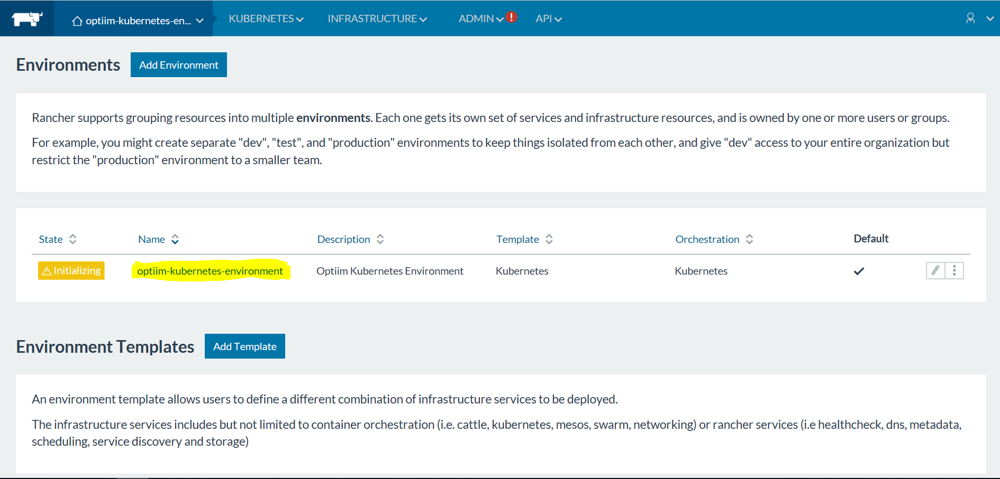

It means that going to the `Kubernates -> Infrastructure Stacks`, from the UI `Kubernets` menu, the `kubenrnetes` stack situaltion will be the following one:

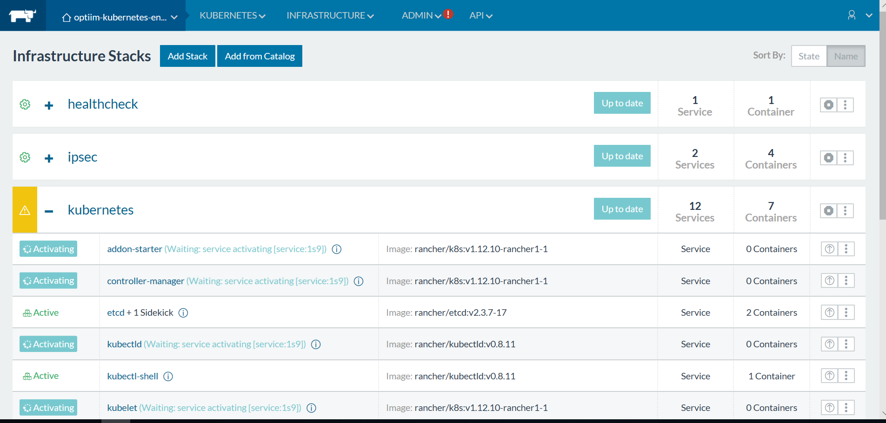

After the Kubernetes network service initialiation, a new stack will be available: `kubernetes-ingress-lbs `, (ready to add new Rancher Kubernetes Load Balancers) as follow:

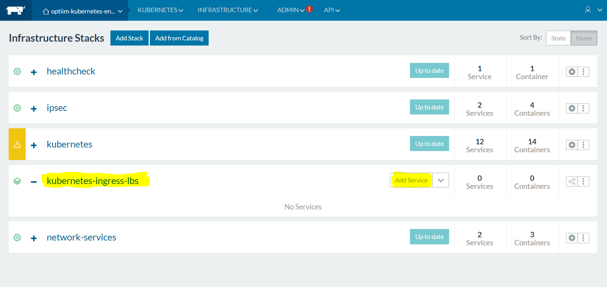

When the `kubernetes` stack is fully initialized on the `Manage Environments`, from the environment menu drop-down, you can see following `Active State`.

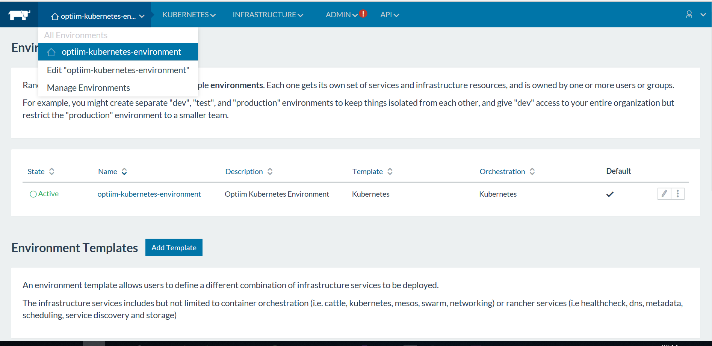

And in the `Kubernates -> Infrastructure Stacks` page situation will be following one:

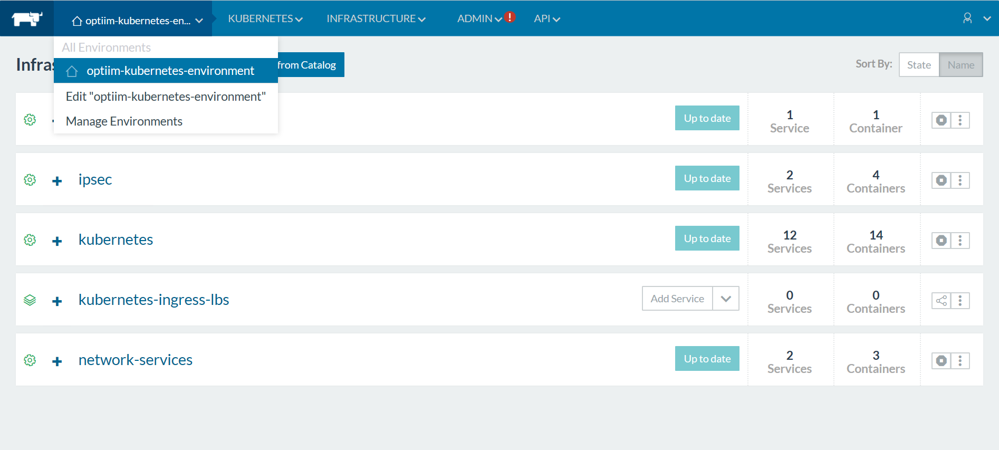

Kubernetes Cluster is now is ready to start deplying Helm Charts....


## Kubernetes Load Balancing service.

On the  `Kubernates -> Infrastructure Stacks` page, right side on the service `kubernetes-ingress-lbs ` line, there is a button, named `Add Service`.

Here screen about available Rancher Kubernetes Load Balamcing services:

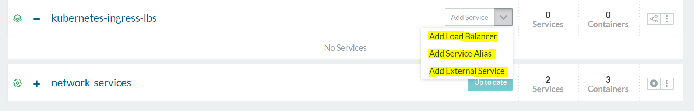


### Rancher Kubernetes Load Balancers

This represents what we know as `Classic Load Balancer`, based on service, but broadcasting specific ports,
on specific rules, etc...

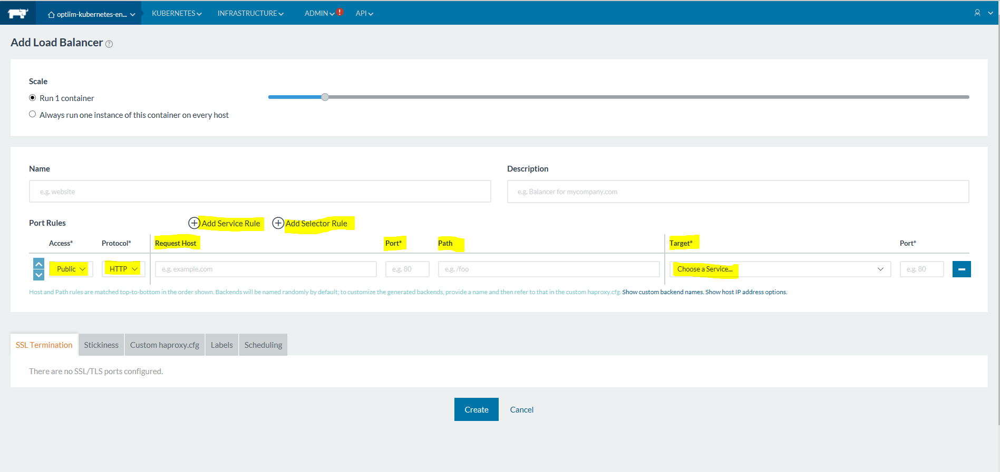


### Rancher Kubernetes Aliases

This represents what we know as `Elastic Load Balancer`, based on service broadcast, without any specific port,
or specific rule, and it's completely managed by the target service. 
Multiple services can be joined under the same alias, visible inside the Kubernetes Cluster, in any wanted namespace.

Any Rancher Stack can be Load Balanced, even Cloud Provider Based Kubernetes Services, such as k3s service.

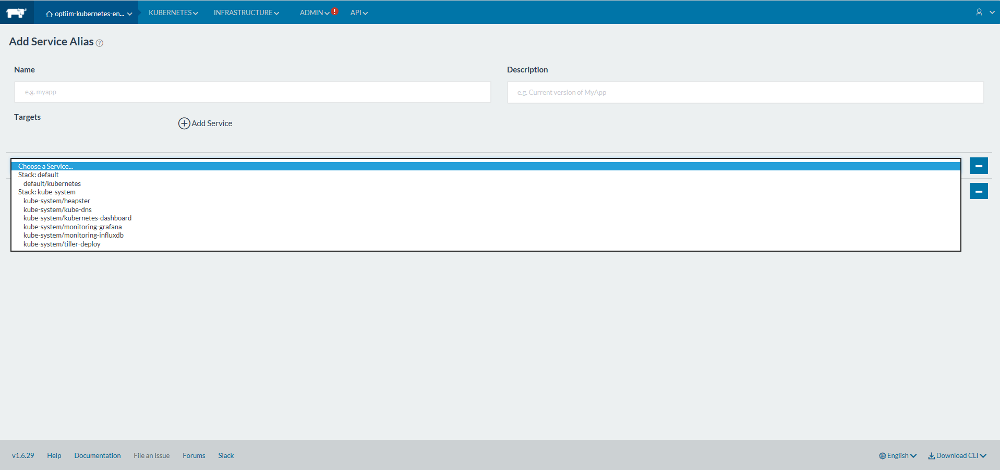


### Rancher External Service`

This represents what we know as `Reverse Proxy`, it allows services into the cluster to access to specific external services,
with a clear and easy way, you can refer on multiple ip address / hostnames and join all under the same service.

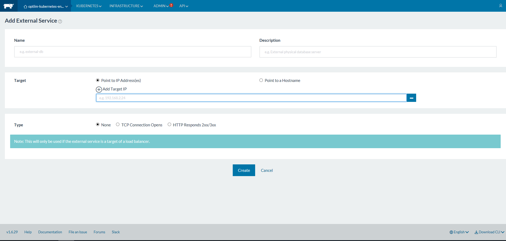 


## Client Interface and collection of the Kubernetes Cluster Configuration file

Accessing to the `Kubernetes -> CLI` page, you can type kubectl commands through a web html unix shell.

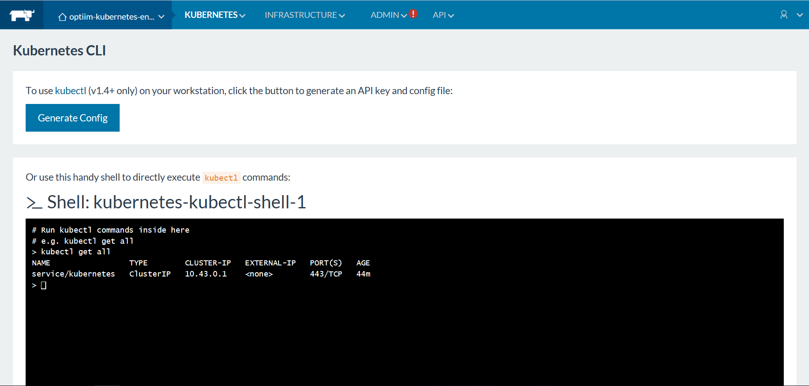

You can click on the `Generate Config` button, then you have a link to copy in clipboard the configuration as yaml data, you can past in a file as suggested by the deploy command.

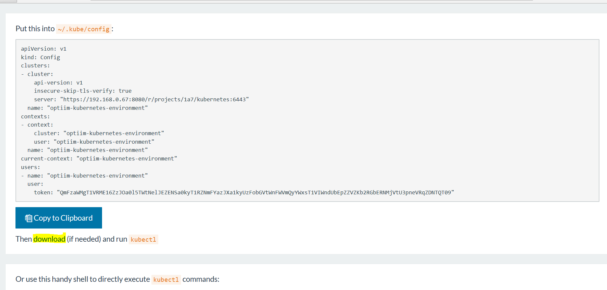


## Kubernetes Dashboard

Accessing to the `Kubernetes -> Dashboard` page, you can access easily to the Kubernetes Control Dashboard page.

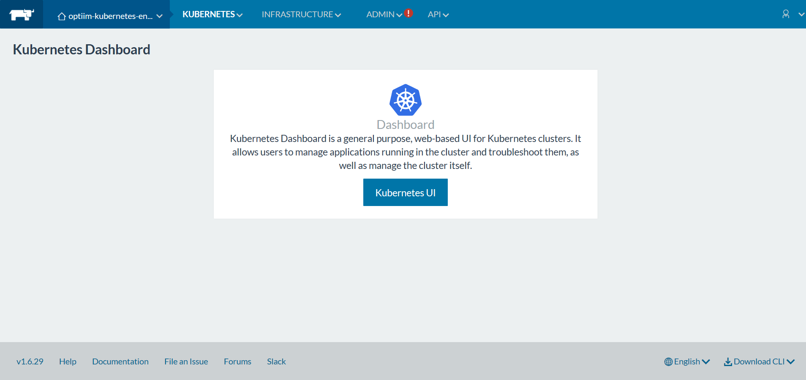

Clicking on the `Kubernetes UI` button, you are redirected into the Kubernetes stack, on the Kubenates Dashboard landing page.

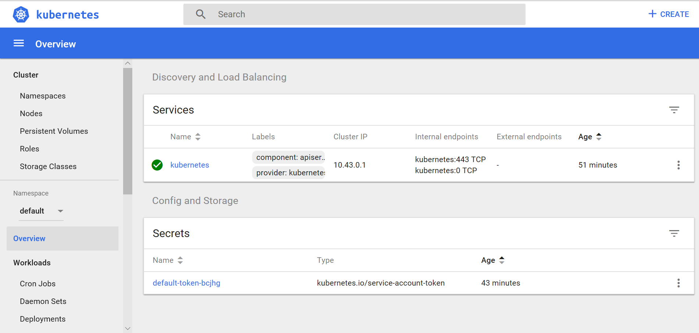

Here you can navigate, configure, explore capabilities in Rancher powered Kubenretes Cluster stacks.

Please do not use default namespaces to install Helm Charts, or contiainers generally, it's insecure, and it's used as landing point, 
then new namespaces will be configured with the appropriate secutiry level.

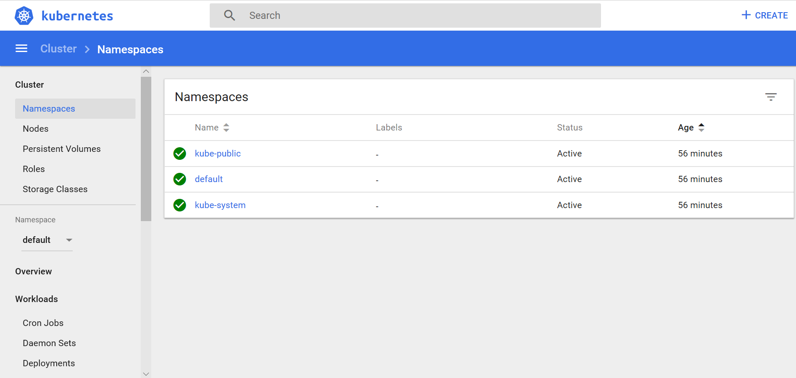

Enjoy your eperience, now you know all you need to start using, exploring and deploying new `Kubernetes Services`.


## Provided docker-machine engines commands

Here list of provided docker-machine engines in the architecture deployiment procedure:

* Microsoft Hyper-V -> required with engine flag: -hv

* Oracle Virtualbox -> required with engine flag: -vb

* Google Cloud engine -> required with engine flag: -gce


Enjoy your experience

## License

Express license of Continuous Software, author: [Fabrizio Torelli](mailto:fabrizio.torelli@optiim.com)
